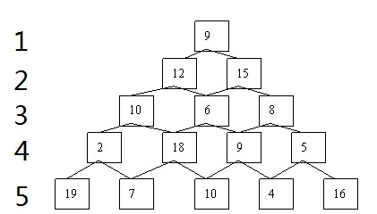

#### 什么是动态规划

动态规划（Dynamic Programming，DP）是用来解决一类最优化问题的算法思想。DP将一个复杂问题分解成若干子问题，且这些子问题会重复出现（这个问题拥有**重叠子问题 Overlapping Subproblems**），通过综合子问题的最优解来得到原问题的最优解。

DP会将求解过程的子问题的解记录下来，这样碰到同样子问题时可以直接使用之前的记录结果而非重复计算。

一般可以使用递归或递推的写法来实现DP，其中递归写法在此处又称作**记忆化搜索**。


####  1.1 动态规划的递归写法

以 Fibonacci为例，普通的递归写法会有许多重复计算，比如在n==5时，F(5) = F(4)+F(3)，接下来算F(4)时又会有F(4)=F(3)+F(2)。F(3)会被计算两次，当n很大时，复杂度会达O(2<sup>n</sup>)，为了**避免重复计算**，可以开一个一维数组dp[n]，用来记录F(n)的结果，`dp[n] = -1`代表F(n)当前还未被计算过（复杂度：O(n) ）。下面是两种代码的比较

```C++
int F(int n) {
	if(n == 0 || n == 1) return 1;
	else retrun F(n - 1) + F(n - 2);
}
```

```c++
int dp[MAX] = {-1};
int F(int n) {
    if(n == 0 || n == 1) return 1; // 递归边界
    if(dp[n] != -1) return dp[n];  // 已经计算过的直接返回结果
    else {
        dp[n] = F(n - 1) + F(n - 2);
        return dp[n];
    }
}
```


#### 1.2 动态规划的递推写法

以**数塔问题**为例，第一层一个数字，第二层两个数字...第n层有n个数字。现在要从第一层走到第n层，每次只能走向下一层连接的两个数字中的一个，<u>问：最后将路径上所有数字相加后得到的和最大是多少？</u>



如果尝试穷尽每条路径，复杂度是O(2<sup>n</sup>)  。注意从9->6（第3层），共有两种可能，如果按照穷举法的话，其实到6后面的可能性是一样的，但是就要多一倍的运算，并且这些运算是没有必要的。

不妨令`dp[i][j]`表示第i行第j个数字出发的到底层的所有路径得到的最大和。`dp[1][1]`就是要得到的最终答案。注意到一个细节：如果要求出从位置（1,1）到底最底层的最大和`dp[1][1]`，则一定要先求出它的两个子问题：从位置（2,1）和（2,2）到达底层的最大和`dp[2][1]`和`dp[2][2]`，即进行了一次**决策**：走第一层的左下还是右下。于是则要比较走哪条路比较大：

```c
dp[1][1] = max(dp[2][1], dp[2][2]) + f[1][1];  // f[i][j]存放的是ij位置的数字
dp[i][j] = max(dp[i+1][j], dp[i+1][j+1]) + f[i][j];
```

同理可以推到ij位置上的数，把`dp[i][j]`称为问题的**状态**， 上面第二条式子称为**状态转移方程**。状态`dp[i][j]`只与第i + 1层的状态有关。可以发现数塔最后一层的dp值总是等于元素本身，即`dp[n][j] == f[n][j]`，把这种可以直接确定其结果的部分称为**边界**，而**动态规划的递推写方法总是从这些边界出发的**，通过状态转移方程扩散到整个dp数组。

下面是样例输入和输出，代码详见 `ex01-tower.cpp`

```input
5
5
8 3
12 7 16
4 10 11 6
9 5 3 9 4
```

```output
44
```


显然使用递归也可以实现上面的例子，从`dp[1][1]`开始递归直至到达边界时返回），两者区别在于：使用**递推写法**的计算方式是**自底向上**，即从边界开始不断向上直至解决目标问题；**递归写法**是**自顶向下**的，即从目标问题开始，将它分解成子问题的组合知道分解至边界问题为止。

**最优子结构（Optimal Substructure）**：一个问题的最优解可由其子问题的最优解有效构造出来。

**一个问题必须拥有重叠子问题和最优子结构，才能使用DP去解决**。

①分治与动态规划：分治法子问题不重叠，如归并排序，且分之花解决的问题不一定是最优化问题。

②贪心与动态规划：它们均要求原问题必须有最优子结构，贪心法采用的计算方式类似于上面介绍的“自顶向下”，但它需要证明当前最优是最后的最优解才能使用。而DP是综合比较一定会得最优解。


#### 2.1 最大连续子序列和

给定一个数字序列 A1,A2,...,An,求i,j（1 <= i <= j <= n),使得Ai+...+Aj最大，输出这个最大和。详见代码`ex02.cpp`

```input
6
-2 11 -4 13 -5 -2
```

```output
20
```

- 令状态dp[i]表示以A[i]作为末尾的连续序列的最大和。这样即求dp数组中的最大值
  - dp[0] = -2; dp[1] = 11; dp[2] = 7;dp[3] =20; dp[4] = 15;
- 这个最大和的连续序列有两种情况：
  - 仅一个元素A[i]，则最大和即为A[i]本身
  - 含多个元素，从前面某处A[i]开始一直到A[i]结尾。最大和是dp[i-1]+A[i]
- 于是得到**状态转移方程**：`dp[i] = max{A[i], dp[i-1]+A[i]}`此式仅与i及i之前的元素相关
- 边界 dp[0] = A[0]
- 于是用一个for循环即可得到整个dp数组，时间复杂度O(n)

- **状态的无后效性**：当前状态记录了历史信息，一旦当前状态确定，就不会再改变，且未来的决策职能在已有的一个或若干个状态的基础上进行，历史信息只能通过已有的去影响未来的决策。
- **如何设计状态及状态转移方程是DP的核心与难点，但并非所有状态都具有无后效性**。


#### 2.2 最长不下降子序列（LIS）

**Longest Increasing Sequence**：在一个数字序列中，找到一个最长的子序列（可以不连续），使得这个子序列是不下降（非递减的）。

例如有序列（下标从1开始）：{1，2，3,-1，-2，7，9}。则最长LIS是{1,2,3,7,9}。若用枚举法每个数都面临取或者不取的问题，复杂度高达O(2<sup>n</sup>)，事实上这里面包含了大量重复计算的问题。

令dp[i]表示以A[i]结尾的最长不下降子序列的长度，于是可能会产生两种可能：

- 如果存在A[i]之前的元素A[j]（i < j），是的A[j] <= A[i]且dp[j] + 1 > dp[i]，那么就把A[i]跟在以A[j]结尾的LIS后面，形成一条更长的不下降子序列（令dp[i] = dp[j]+1）
- 如果A[i]前面的元素都比A[i]大，那么A[i]只好形成一条仅自己一个元素的LIS

最后，以A[i]结尾的LIS长度就是上述两种情况形成的最大长度。    

Q:现有序列，{1,5，-1,3}（下标从1开始），已知A[1]、A[2]、A[3]为结尾的LIS及其长度，那么如何得知A[4]的LIS及其长度呢？

A：考虑将A[4]**分别**加入到前面几个为结尾的序列后面，比较之后得知只有加在A[1]和A[3]后面才会变长。写出**状态转移方程**：代码详见`ex03-LIS.cpp`,复杂度：O(n<sup>2</sup>)

```c
dp[i] = max{1, dp[j] + 1}
(j = 1,2,...,i-1 && A[i] > A[j])  // j = 1时即为边界
```

```input
8
1 2 3 -9 3 9 0 11
```

```output
6    // 1 2 3 3 9 11
```

ps:如何输出这个最长子序列？


#### 2.3最长公共子序列（LCS）

**Longest Common Sequence**：给定两个字符串A和B，求一个字符串，使得这个字符串是A和B的最长公共部分（子序列可以不连续）

```
in:
sadstory
adminsorry

out:
6   // adsory
```

暴力解法：设两个字符串长度分别为mn，那么对两个字符串中的字符，每个字符都有选与不选两个决策，而得到两个子序列是否相同又需要O(max(m,n))，这样总的时间复杂度：O(2<sup>m+n</sup> * max(m,n))。

DP解法：令`dp[i][j]`表示字符串A的第i号位和字符串B的j号位之前的LCS长度（下标从1开始），如`dp[4][5]`表示"sads"与"admins"的LCS长度，比较A[4]和B[6]发现两者都是‘s'，因此`dp[4][6]` = `dp[3][5]`+1, 即为3。那么根据A[i]和B[j]的情况可以分为两种决策：

- A[i] == B[j]，则字符串A与B的LCS增加1位

- A[i] != B[j]，则字符串A的i号位和字符串B的j号位之前的LCS无法延长，因此`dp[i][j]`将会继承`dp[i-1][j]`与`dp[i][j-1]`中的较大值。如`dp[3][3]`表示"sad"与"adm"的LCS长度，比较A[3]与B[3]发现'd' != 'm'，这样`dp[3][3]`无法在原先的基础上延长，因此继承自"sa"与"adm"的LCS、"sad"与"ad"的LCS的较大值

得到**状态转移方程**：时间复杂度O(nm),`dp[n][m]`即为所求答案，详见代码`ex04-LCS.cpp`

```c
dp[i][j] = { dp[i-1][j-1]+1,  A[i]==B[j]
		   { max{dp[i-1], dp[i][j-1]},   A[i]!=B[j]
dp[i][0] = dp[0][j] = 0;   // 边界
```


#### 2.4最长回文子串

给出一个字符串S，求S的最长回文子串的长度

```in
PATZJUJZTACCBCC
```

```out
9   // ATZJUJZTA
```

暴力解法：枚举子串的两个端点i和j，判断[i,j]区间内的子串是否回文，枚举端点需要O(n<sup>2</sup>)，判断回文需要O(n),因此总的复杂度为O(n<sup>3</sup>)

dp解法：时间复杂度O(n<sup>2</sup>)，还有二分+hash的做法复杂度为O(nlogn)，以及Manacher的复杂度为O(n)的做法。

`dp[i][j]`**代表S[i]至S[j]所表示的子串是否为回文子串**，用0和1区分。判断S[i]与S[j]的情况，把转移情况分为两类：

- S[i] == S[j]，
  - S[i+1]至S[j-1]是回文子串，则S[i]至S[j]就是回文子串；
  - S[i+1]至S[j-1]不是回文子串，则S[i]至S[j]不是回文子串；
- S[i] != S[j]，S[i]至S[j]一定不是回文子串。（回文子串的首尾总得是相同的）

**状态转移方程**：

```
dp[i][j] = { dp[i+1][j-1], S[i] == S[j]
    	   { 0, S[i] != S[j]
```

边界：

```
dp[i][i] = 1
dp[i][i+1] = (S[i] == S[i+1] ? 1 : 0)
```

到这还有一个问题尚未解决：若按照ij从小到大的顺序枚举子串的两个端点，然后更新dp数组，会无法保证`dp[i+1][j-1]`已经被计算过，那`dp[i][i]`也就会不正确。事实上，对ij枚举顺序无论做何调整，都无法调和这个矛盾。根据递推写法从边界出发的原理，注意到边界表示的是长度为1和2的子串，且每次转移时都对子串的长度减了1，**因此不妨考虑按子串的长度和子串的初始位置进行枚举**，即第一遍将长度为3的子串的dp值全部求出，第二遍根据第一遍的结果计算出长度为4的子串的dp值...

详见代码`ex05-PalindromeString.cpp`

